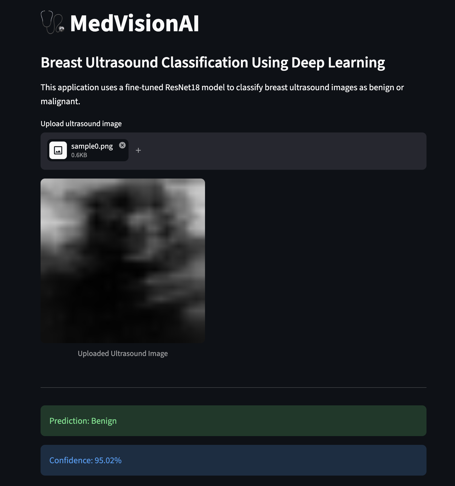
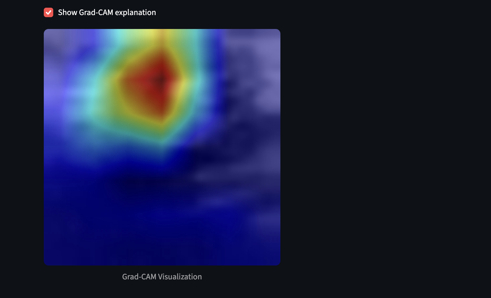
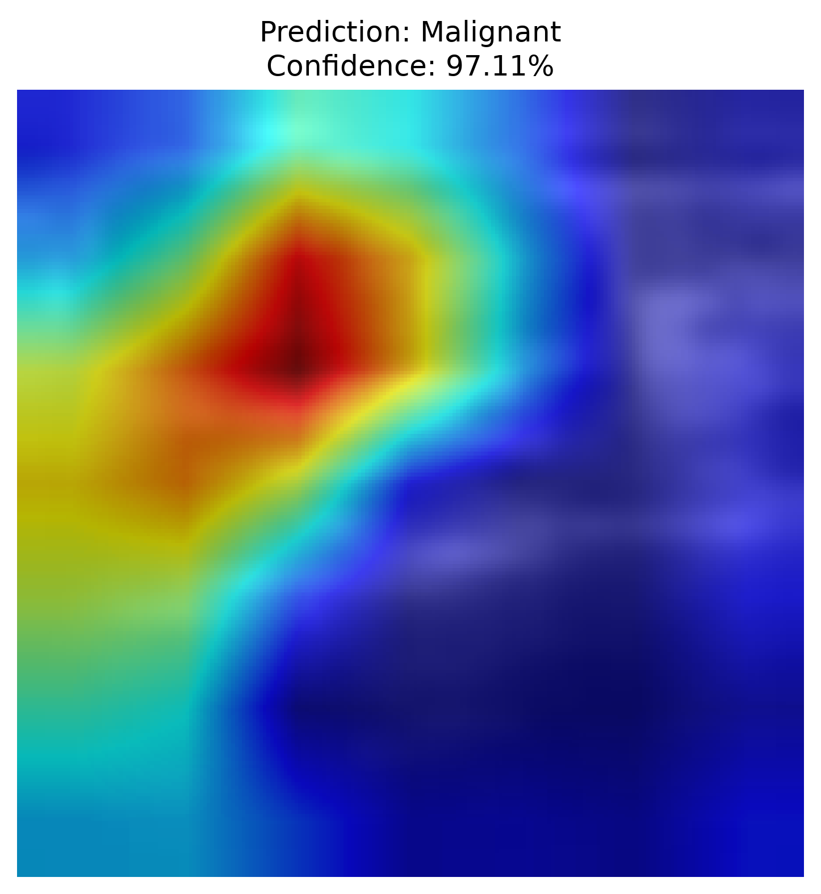
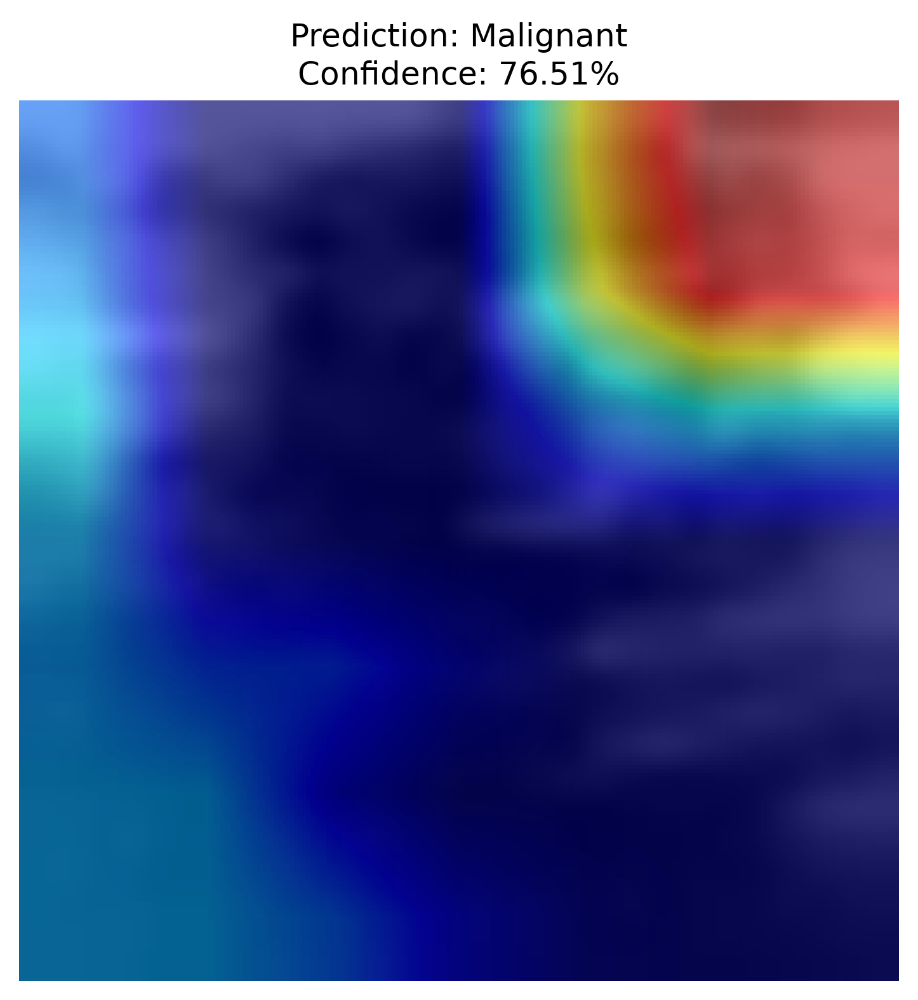
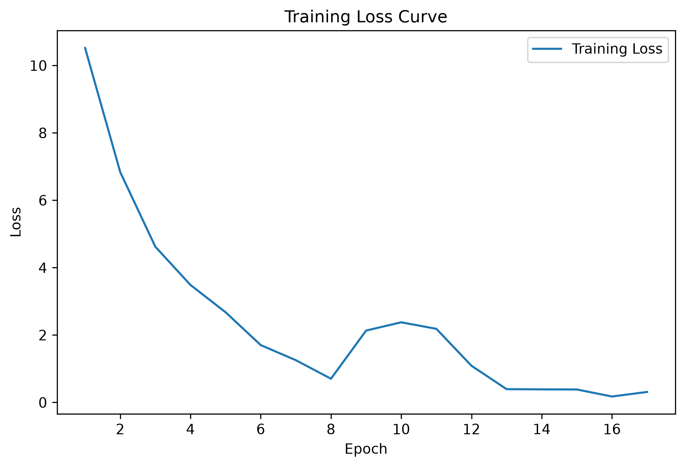
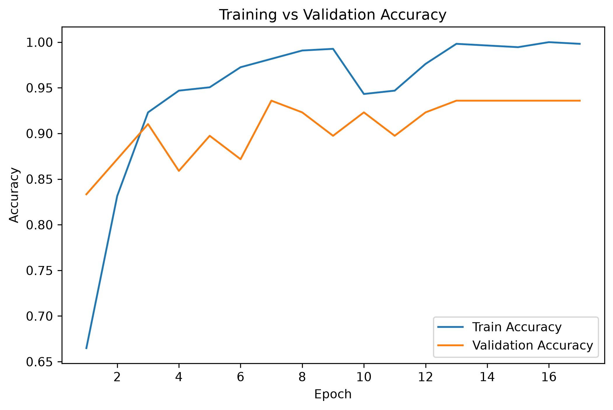
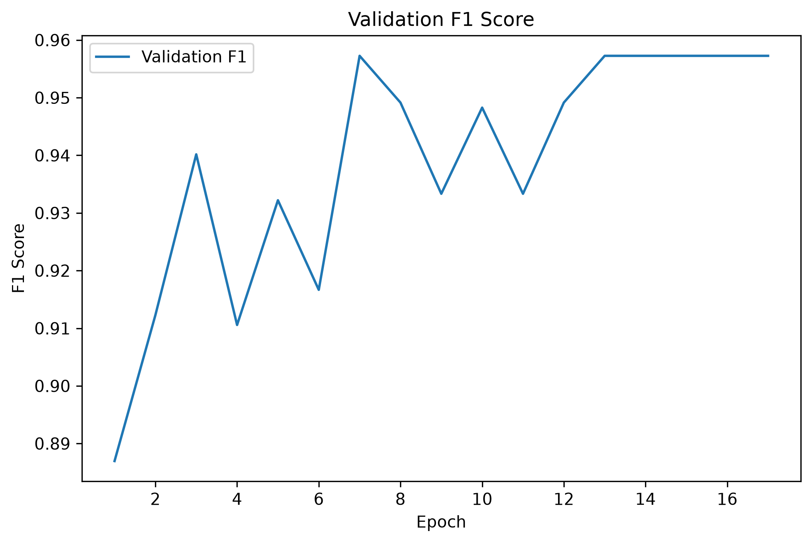

# MedVisionAI

## Breast Cancer Classification Using Deep Learning and Transfer Learning

MedVisionAI is a deep learning computer vision project developed to classify breast ultrasound images into two categories:

- **Benign**
- **Malignant**

The project explores medical image classification using:

- Convolutional Neural Networks (CNNs)
- Transfer Learning
- ResNet18
- Image preprocessing and augmentation techniques
- Model evaluation and performance analysis

The final model uses a modified **ResNet18 transfer learning architecture** optimized for the **BreastMNIST dataset** from the MedMNIST collection.

The goal of this project is to build a complete medical image classification pipeline, including:

- Dataset preparation
- Image preprocessing
- Data augmentation
- Baseline CNN modeling
- Transfer learning
- Model optimization
- Evaluation using classification metrics
- Performance analysis


---

## Live Demo

Try the deployed MedVisionAI application:

🔗 **Live Demo:** https://medvisionai-web.streamlit.app

The application allows users to upload breast ultrasound images and receive:
- Benign or malignant classification
- Prediction confidence score
- Grad-CAM visualization showing regions influencing the model decision


## Demo Screenshots

### Ultrasound Classification

The model accepts grayscale breast ultrasound images and predicts whether the sample is benign or malignant.




### Grad-CAM Explainability

Grad-CAM is used to visualize which regions of the ultrasound image contribute most to the model's prediction.




## Explainable AI (Grad-CAM)

To improve model transparency, MedVisionAI integrates Gradient-weighted Class Activation Mapping (Grad-CAM).

Grad-CAM highlights important image regions used by the ResNet18 model when making predictions, helping users understand the model's decision-making process.


## Deployment

MedVisionAI is deployed using Streamlit Community Cloud.

Deployment pipeline:

```
GitHub Repository
        |
        v
Streamlit Community Cloud
        |
        v
MedVisionAI Web Application
```

The application runs inference using the fine-tuned ResNet18 model checkpoint.


## Model Performance

Final evaluation on the BreastMNIST test set:

| Metric | Score |
|---|---:|
| Accuracy | 88.46% |
| Precision | 91.38% |
| Recall | 92.98% |
| F1 Score | 92.17% |

Confusion Matrix:

```
[[32 10]
 [ 8 106]]
```


## Limitations

⚠️ MedVisionAI is a research and educational project only.

It is not a medical diagnostic system and should not be used for clinical decisions.

The model was trained and evaluated on the BreastMNIST dataset and may not generalize to all real-world ultrasound images, equipment, populations, or clinical environments.


# Project Overview

Medical image classification is a challenging computer vision problem due to several factors:

- Limited dataset sizes
- Class imbalance
- High risk of overfitting
- Difficulty extracting meaningful visual features

This project addresses these challenges through:

- Transfer learning from ImageNet pretrained models
- Data augmentation
- Class-weighted loss functions
- Learning rate scheduling
- Early stopping
- Comprehensive model evaluation


The workflow follows a typical deep learning research pipeline:

```text
                 BreastMNIST Dataset
                         |
                         ↓
              Dataset Loading & Exploration
                         |
                         ↓
              Image Preprocessing
        (Resize + Tensor Conversion + Normalization)
                         |
                         ↓
                  Data Augmentation
        (Random Rotation + Random Translation)
                         |
                         ↓
             Train / Validation / Test Split
                         |
                         ↓
              Model Development Stage
                         |
              ┌──────────┴──────────┐
              ↓                     ↓
        CNN Baseline        ResNet18 Transfer
           Model                Learning
              ↓                     ↓
     Performance Benchmark   Architecture Adaptation
                                    |
                                    ↓
                         Grayscale Input Modification
                         RGB (3 Channels) → Grayscale (1 Channel)
                                    |
                                    ↓
                         Replace Classification Head
                         1000 Classes → 2 Classes
                                    |
                                    ↓
                             Model Training
                                    |
                                    ↓
                      Weighted Cross Entropy Loss
                                    |
                                    ↓
                        Adam Optimizer + Scheduler
                                    |
                                    ↓
                            Early Stopping
                                    |
                                    ↓
                         Best Model Checkpoint
                                    |
                                    ↓
                            Model Evaluation
                                    |
                                    ↓
              Accuracy | Precision | Recall | F1 Score
                                    |
                                    ↓
                         Performance Analysis
```


---

# Dataset

## BreastMNIST

This project uses the **BreastMNIST** dataset from the MedMNIST collection.

Dataset source:

https://medmnist.com/


BreastMNIST is a grayscale breast ultrasound image dataset designed for binary classification.

The task is:

| Class | Description |
|---|---|
| 0 | Benign |
| 1 | Malignant |


## Dataset Characteristics

- Medical ultrasound images
- Grayscale format
- Binary classification problem
- Small-scale medical imaging dataset
- Suitable for machine learning research


---

# Project Pipeline

The complete pipeline implemented in this project:

```text
                 BreastMNIST Dataset
                         |
                         ↓
              Dataset Loading & Exploration
                         |
                         ↓
              Image Preprocessing
        (Resize + Tensor Conversion + Normalization)
                         |
                         ↓
                  Data Augmentation
        (Random Rotation + Random Translation)
                         |
                         ↓
             Train / Validation / Test Split
                         |
                         ↓
              Model Development Stage
                         |
              ┌──────────┴──────────┐
              ↓                     ↓
        CNN Baseline        ResNet18 Transfer
           Model                Learning
              ↓                     ↓
     Performance Benchmark   Architecture Adaptation
                                    |
                                    ↓
                         Grayscale Input Modification
                         RGB (3 Channels) → Grayscale (1 Channel)
                                    |
                                    ↓
                         Replace Classification Head
                         1000 Classes → 2 Classes
                                    |
                                    ↓
                             Model Training
                                    |
                                    ↓
                      Weighted Cross Entropy Loss
                                    |
                                    ↓
                        Adam Optimizer + Scheduler
                                    |
                                    ↓
                            Early Stopping
                                    |
                                    ↓
                         Best Model Checkpoint
                                    |
                                    ↓
                            Model Evaluation
                                    |
                                    ↓
              Accuracy | Precision | Recall | F1 Score
                                    |
                                    ↓
                         Performance Analysis
```


---

# Development Environment

The project was developed using:


| Component | Version |
|---|---|
| Python | 3.12 |
| PyTorch | Latest |
| Torchvision | Latest |
| Scikit-learn | Latest |
| MedMNIST | Latest |
| Hardware | Apple Silicon |
| Acceleration | Apple Metal Performance Shaders (MPS) |


The model was trained using Apple's GPU acceleration:

Using device: mps

This allowed training with hardware acceleration on an Apple Silicon Mac.


---

# Project Structure

```text
MedVisionAI/
│
├── models/
│   └── checkpoints/
│       ├── resnet18_finetuned_v2.pth
│       └── cnn_optimized.pth
│
├── notebooks/
│   └── 01_dataset_exploration.ipynb
│
├── scripts/
│   ├── test_dataloader.py
│   ├── test_model.py
│   └── __init__.py
│
├── src/
│   │
│   ├── data/
│   │   ├── dataloader.py
│   │   └── resnet_dataloader.py
│   │
│   ├── models/
│   │   ├── cnn.py
│   │   └── resnet.py
│   │
│   ├── train/
│   │   ├── train.py
│   │   └── train_resnet.py
│   │
│   ├── evaluate/
│   │   ├── evaluate.py
│   │   └── evaluate_resnet.py
│   │
│   └── __init__.py
│
├── .gitignore
├── LICENSE
├── README.md
└── requirements.txt
```

---

## Directory Explanation

### `models/`

Contains trained model checkpoints.

```
models/checkpoints/
```

Stores saved weights for trained models:

- `resnet18_finetuned_v2.pth`  
  Final ResNet18 transfer learning model

- `cnn_optimized.pth`  
  Baseline CNN model checkpoint


---

### `notebooks/`

Contains Jupyter notebooks used for experimentation and analysis.

Current notebook:

```
01_dataset_exploration.ipynb
```

Used for:

- Exploring BreastMNIST samples
- Understanding dataset distribution
- Initial experimentation


---

### `scripts/`

Contains utility scripts for testing project components.

Examples:

- Testing dataset loading
- Verifying model architecture
- Checking preprocessing pipeline


---

### `src/data/`

Contains dataset handling and preprocessing code.

Files:

`dataloader.py`

- Loads BreastMNIST dataset
- Handles baseline CNN data preparation


`resnet_dataloader.py`

- Prepares data specifically for ResNet18
- Applies resizing, augmentation, and normalization


---

### `src/models/`

Contains deep learning model architectures.

Files:

`cnn.py`

- Custom CNN baseline architecture


`resnet.py`

- Modified ResNet18 transfer learning architecture
- Converts RGB input to grayscale
- Replaces ImageNet classifier with binary classifier


---

### `src/train/`

Contains training scripts.

Files:

`train.py`

- Trains the baseline CNN model


`train_resnet.py`

- Trains the ResNet18 transfer learning model
- Handles:
  - Weighted loss
  - Learning rate scheduling
  - Early stopping
  - Model checkpoint saving


---

### `src/evaluate/`

Contains evaluation scripts.

Files:

`evaluate.py`

- Evaluates baseline CNN performance


`evaluate_resnet.py`

- Evaluates the final ResNet18 model
- Calculates:
  - Accuracy
  - Precision
  - Recall
  - F1 Score
  - Confusion Matrix


---

### Root Files

`README.md`

Project documentation.


`requirements.txt`

Python dependencies required to run the project.


`LICENSE`

Project licensing information.


`.gitignore`

Specifies files excluded from version control.


## Directory Explanation


### `models/`

Contains trained model checkpoints.

Example:

-resnet18_finetuned_v2.pth

Stores the best-performing ResNet18 model weights.


---

### `src/data/`

Contains dataset loading and preprocessing pipelines.


Files:

-dataloader.py

Handles the CNN baseline data pipeline.

-resnet_dataloader.py

Handles:

- Image resizing
- Augmentation
- Normalization
- Train/validation/test loading


---

### `src/models/`

Contains model architectures.

-cnn.py

Custom CNN baseline model.

-resnet.py

Modified ResNet18 transfer learning model.


---

### `src/train/`

Training scripts.

-train.py

CNN baseline training.

-train_resnet.py

Final ResNet18 training pipeline.


---

### `src/evaluate/`

Evaluation scripts.

-evaluate.py

CNN evaluation.

-evaluate_resnet.py

ResNet18 evaluation using:

- Accuracy
- Precision
- Recall
- F1-score
- Confusion matrix


# Models

Two different deep learning approaches were explored during development:

1. Custom CNN Baseline Model
2. ResNet18 Transfer Learning Model


---

# 1. CNN Baseline Model

A custom Convolutional Neural Network (CNN) was initially developed as a baseline model.

The purpose of the baseline model was to:

- Establish an initial performance benchmark
- Understand the difficulty of the dataset
- Compare traditional CNN training against transfer learning


## Baseline Performance

The CNN baseline achieved approximately:
Validation Accuracy:
~77%


Although the CNN was able to learn meaningful patterns from the ultrasound images, the small dataset size limited generalization performance.

This motivated the use of transfer learning with a pretrained architecture.


---

# 2. ResNet18 Transfer Learning Model

The final model uses **ResNet18 transfer learning**.

Instead of training a deep neural network from scratch, the model uses features learned from ImageNet and adapts them for breast ultrasound image classification.


Transfer learning provides several advantages:

- Better feature extraction
- Faster convergence
- Improved performance on small datasets
- Reduced risk of overfitting


---

# ResNet18 Architecture Modification

The original ResNet18 model was designed for RGB image classification.

Original architecture:

```text
RGB Image

3 Channels

        ↓

ResNet18

        ↓

1000 ImageNet Classes

However, BreastMNIST images are grayscale ultrasound images.

Therefore, the architecture was modified:

Grayscale Ultrasound Image

1 Channel

        ↓

Modified ResNet18

        ↓

Binary Classifier

        ↓

Benign / Malignant

# Input Layer Modification

## Original ResNet18

The original ResNet18 architecture was designed for RGB images.

The first convolution layer expects 3 input channels:

```python
Conv2d(
    3,
    64
)
```

This corresponds to:

```
Red Channel
Green Channel
Blue Channel
```

However, BreastMNIST images are grayscale ultrasound images, meaning they contain only one image channel.


---

## Modified ResNet18

The first convolution layer was modified to accept single-channel grayscale images:

```python
Conv2d(
    1,
    64
)
```

The modified input pipeline becomes:

```text
Grayscale Ultrasound Image

        ↓

1 Input Channel

        ↓

Modified ResNet18

        ↓

Feature Extraction

        ↓

Binary Classification
```

To preserve the pretrained ImageNet features, the original RGB convolution filters were converted into grayscale filters by averaging the RGB weights:

```python
new_conv.weight[:] = old_conv.weight.mean(
    dim=1,
    keepdim=True
)
```

This allows the model to reuse previously learned visual features while adapting the network for medical grayscale images.


---

# Classification Head Modification

The original ResNet18 model was trained for ImageNet classification:

```
1000 ImageNet Classes
```

For this project, the final classification layer was replaced with a binary classifier:


```
2 Classes

0 → Benign

1 → Malignant
```


Implementation:

```python
self.model.fc = nn.Linear(
    self.model.fc.in_features,
    2
)
```


---

# Data Preprocessing

BreastMNIST images are originally:

```
28 × 28 pixels
```

Since ResNet18 was pretrained on ImageNet, images were resized to:

```
224 × 224 pixels
```

This allows the model to use the same input dimensions it learned during pretraining.


---

# Normalization

Image normalization was applied before training:

```python
mean=[0.4829]

std=[0.229]
```

Normalization helps:

- Stabilize training
- Improve convergence
- Match the distribution expected by pretrained models


---

# Data Augmentation

Medical image datasets are often limited in size, increasing the risk of overfitting.

To improve generalization, training images were augmented using:


## Random Rotation

```python
RandomRotation(
    degrees=5
)
```

Purpose:

- Simulates small changes in image orientation
- Makes the model less sensitive to rotation variations


---

## Random Translation

```python
RandomAffine(
    degrees=0,
    translate=(0.05,0.05)
)
```

Purpose:

- Simulates slight changes in image position
- Improves robustness against image alignment differences


Validation and test datasets were not augmented to ensure unbiased evaluation.


---

# Training Strategy

The final training pipeline included:


## Weighted Cross Entropy Loss

The dataset contains class imbalance, therefore weighted Cross Entropy Loss was used:

```python
CrossEntropyLoss(
    weight=class_weights
)
```

Class weighting helps the model pay more attention to underrepresented samples and reduces bias toward the majority class.


---

## Optimizer

The model was trained using the Adam optimizer:

```python
Adam
```

Learning rate:

```
0.0001
```

Adam was selected because it provides adaptive learning rates and performs well for deep learning image classification tasks.


---

## Learning Rate Scheduler

A ReduceLROnPlateau scheduler was used:

```python
ReduceLROnPlateau
```

Configuration:

```
factor = 0.5

patience = 3
```

The scheduler automatically reduces the learning rate when validation performance stops improving.


---

## Early Stopping

Early stopping was implemented to prevent overfitting.

Configuration:

```
Maximum epochs: 50

Patience: 10 epochs
```

During training, the model automatically saves the checkpoint with the best validation performance:

```
Saved best model!
```


---

# Model Checkpoint

The final trained model is saved as:

```
models/checkpoints/resnet18_finetuned_v2.pth
```

The saved checkpoint contains the learned model weights and can be loaded later for evaluation or inference.

# Final Model Performance

After training and optimization, the final ResNet18 transfer learning model achieved strong performance on the BreastMNIST test dataset.


## Final Test Results

The final ResNet18 transfer learning model achieved:

| Metric | Score |
|---|---:|
| Accuracy | 88.46% |
| Precision | 91.38% |
| Recall | 92.98% |
| F1 Score | 92.17% |


Confusion Matrix:

\[
\begin{bmatrix}
32 & 10 \\
8 & 106
\end{bmatrix}
\]


Interpretation:

- 32 benign samples were correctly classified
- 106 malignant samples were correctly classified
- 10 benign samples were incorrectly classified as malignant
- 8 malignant samples were incorrectly classified as benign


---


# Metric Interpretation


## Accuracy

Accuracy measures the percentage of all correctly classified images:


```
Correct Predictions / Total Predictions
```


The model achieved:


```
84.62%
```


---

## Precision

Precision measures how many predicted malignant cases were actually malignant:


```
True Positives / (True Positives + False Positives)
```


Result:


```
88.79%
```


A high precision means the model produces relatively few false positive malignant predictions.


---

## Recall

Recall measures how many actual malignant cases were successfully detected:


```
True Positives / (True Positives + False Negatives)
```


Result:


```
90.35%
```


High recall is important in medical screening because missing malignant cases is more costly than producing additional false alarms.


---

## F1 Score

The F1 score balances precision and recall:


```
2 × (Precision × Recall) / (Precision + Recall)
```


Result:


```
89.57%
```


The strong F1 score indicates a good balance between detecting malignant cases and avoiding unnecessary false positives.


---

# Training Performance

The best validation performance achieved during training:


```
Best Validation F1 Score:

0.9550
```


Training progression:


```
Epoch 1:

Validation F1:
0.7447


Epoch 3:

Validation F1:
0.9550
```


The model achieved strong performance early because transfer learning allowed ResNet18 to reuse previously learned visual features.


---

# Installation


## Clone Repository

```bash
git clone <https://github.com/DunatosCharles/MedVisionAI.git>

cd MedVisionAI
```


---

## Create Virtual Environment

```bash
python -m venv clean_test
```


Activate the environment:


### macOS / Linux

```bash
source clean_test/bin/activate
```


---

## Install Dependencies

```bash
pip install -r requirements.txt
```


---

# Training

To train the ResNet18 model:


```bash
python -m src.train.train_resnet
```


Example training output:


```text
Using device: mps

Epoch 3/50 |
Train Acc: 0.8608 |
Val Acc: 0.9359 |
Val F1: 0.9550

Saved best model!
```


The best checkpoint is automatically saved:

```
models/checkpoints/resnet18_finetuned_v2.pth
```


---

# Evaluation

To evaluate the trained model:


```bash
python -m src.evaluate.evaluate_resnet
```


Example output:


```text
Accuracy: 0.8461

Precision: 0.8879

Recall: 0.9035

F1: 0.8957
```


The evaluation script also generates a confusion matrix showing classification performance across both classes.


---

# Model Explainability

To improve interpretability, Grad-CAM was implemented to visualize which regions of the ultrasound image influenced the model prediction.

Grad-CAM generates a heatmap over the input image, highlighting important feature regions used by the ResNet18 model.

Example:

## Grad-CAM Explainability

Grad-CAM was implemented to visualize the regions of the ultrasound image that influenced the model prediction.

### Correct Classification Example




Example output:

Prediction: Malignant
Confidence: 97.11%
True Label: Malignant

### Misclassification Example

The model can still make incorrect predictions due to the limited size and complexity of the dataset.




Example output:

Prediction: Malignant
Confidence: 76.51%
True Label: Benign


This highlights the importance of explainability methods when analyzing medical AI models.

# Model Inference

The trained model can be used for prediction on new ultrasound images.

Example:

```bash
python -m scripts.predict screenshots/gradcam_example.png

# Model Loading

The trained model can be loaded using:


```python
model.load_state_dict(
    torch.load(
        "models/checkpoints/resnet18_finetuned_v2.pth"
    )
)
```


The model can then be used for:

- Testing new ultrasound images
- Building inference pipelines
- Integrating into applications


---

# Reproducibility

The project includes:

- Dataset loading scripts
- Training scripts
- Evaluation scripts
- Saved model checkpoints


The complete workflow can be reproduced by:

1. Installing dependencies
2. Running the training script
3. Loading the saved checkpoint
4. Running evaluation

# Future Improvements

Although the current model achieves strong performance, there are several possible improvements that could make the system more robust and practical.


---

# 1. Grad-CAM Visualization

A future improvement would be adding **Gradient-weighted Class Activation Mapping (Grad-CAM)**.

Grad-CAM allows visualization of which regions of an ultrasound image influenced the model's prediction.


Possible workflow:


```text
Ultrasound Image

        +

Trained ResNet18 Model

        ↓

Prediction

        ↓

Grad-CAM Heatmap

        ↓

Highlighted Important Regions
```


Benefits:

- Improves model interpretability
- Helps understand model decisions
- Provides visual explanations for predictions


---

# 2. Web Application Deployment

The trained model could be integrated into an interactive application.


Possible features:

- Upload ultrasound image
- Generate prediction
- Display confidence score
- Display Grad-CAM explanation
- Provide model information


Possible technologies:

- Streamlit
- FastAPI
- React frontend


Example workflow:


```text
User Uploads Image

        ↓

Image Preprocessing

        ↓

ResNet18 Model

        ↓

Prediction

        ↓

Result + Explanation
```


---

# 3. Experiment With Larger Architectures

Future experiments could compare ResNet18 with more advanced architectures:


Possible models:

- ResNet50
- EfficientNet
- Vision Transformers (ViT)
- ConvNeXt


These models may improve performance by learning more complex visual patterns.


---

# 4. Cross Validation

Because medical datasets are often small, a single train-validation-test split may not fully represent model performance.

Future work could include:

- K-fold cross validation
- Multiple training runs
- Statistical performance analysis


This would provide a more reliable estimate of model generalization.


---

# 5. Model Optimization

Additional improvements could include:


## Hyperparameter Optimization

Experimenting with:

- Learning rates
- Batch sizes
- Optimizers
- Data augmentation strength


## Advanced Augmentation

Testing methods such as:

- Random cropping
- Contrast adjustment
- Gaussian noise
- MixUp
- CutMix


## Ensemble Methods

Combining multiple models could improve prediction stability.


---

## Training Curves

### Loss



### Accuracy



### Validation F1



# Disclaimer

This project is developed for **educational and research purposes only**.

It is **not a medical diagnostic system** and should not be used for real clinical decision-making.

The predictions generated by this model should not replace professional medical evaluation, imaging specialists, or healthcare professionals.


---

# Author

**Dunatos Charles**

Machine Learning / Computer Vision Developer


## Interests

- Artificial Intelligence
- Deep Learning
- Computer Vision
- Medical AI
- Machine Learning Research


---

# Project Summary

MedVisionAI demonstrates the application of deep learning and transfer learning techniques for medical image classification.

The project covers the complete machine learning workflow:

```text
Dataset Preparation

        ↓

Image Processing

        ↓

Model Development

        ↓

Transfer Learning

        ↓

Training Optimization

        ↓

Evaluation

        ↓

Performance Analysis
```


The project serves as a foundation for exploring more advanced medical AI systems and explainable deep learning solutions.