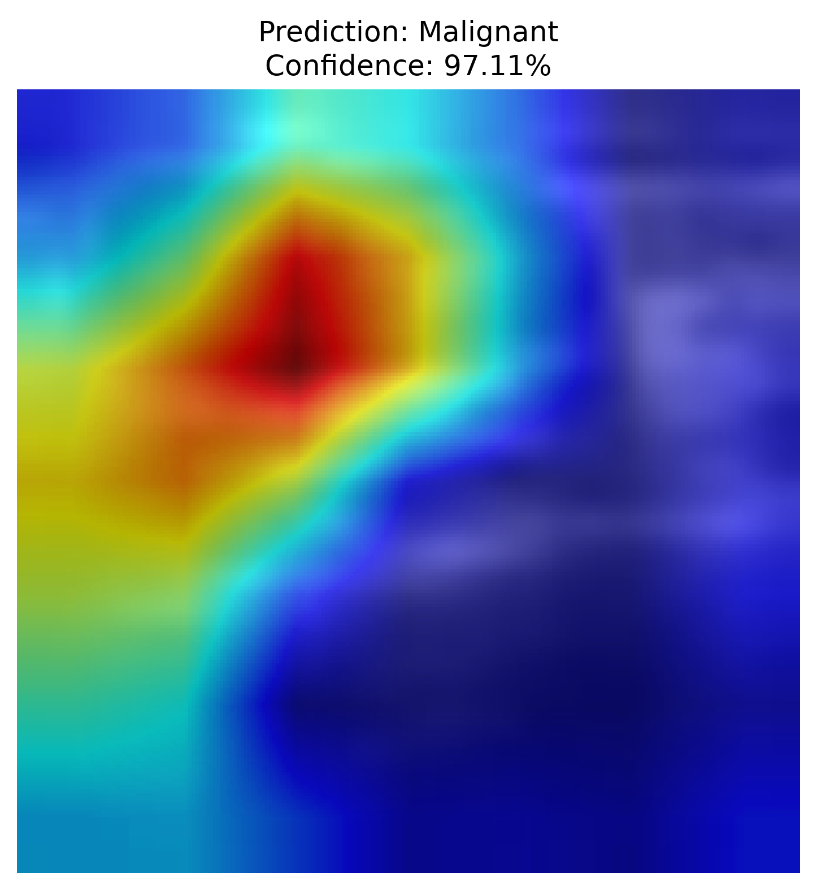
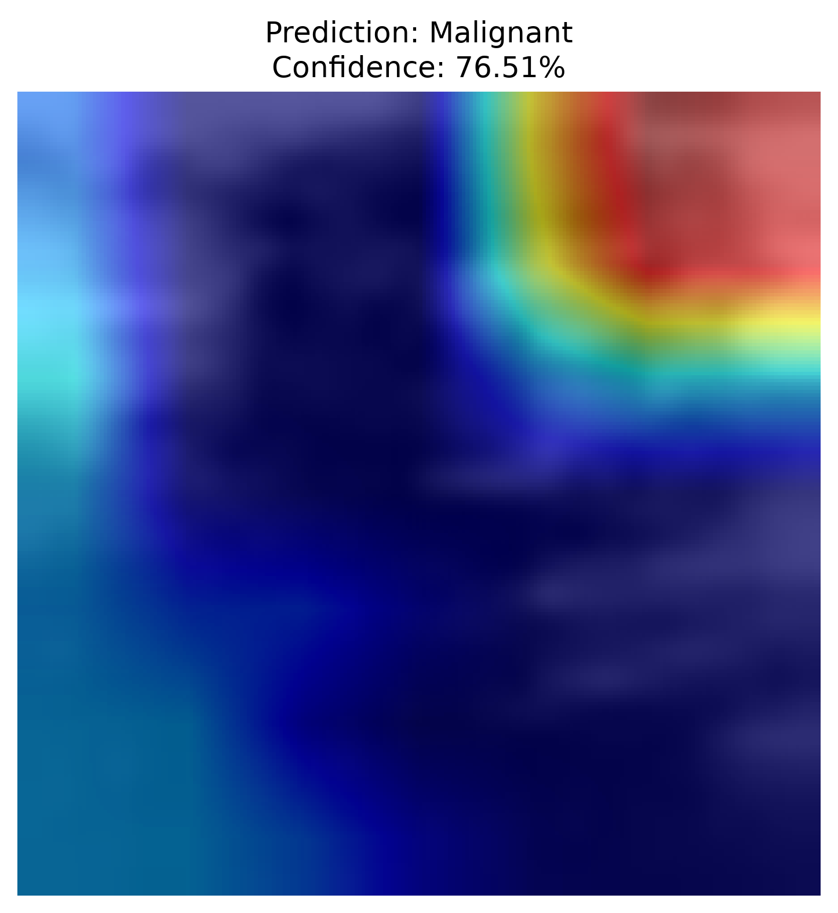
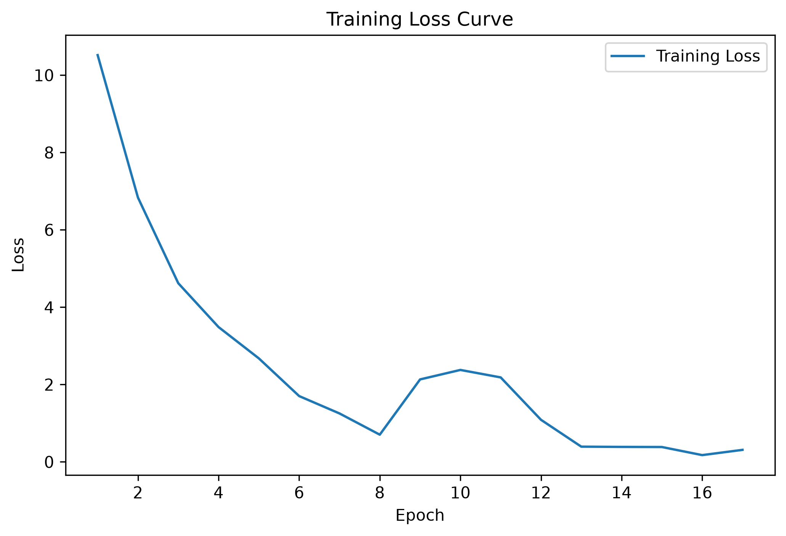
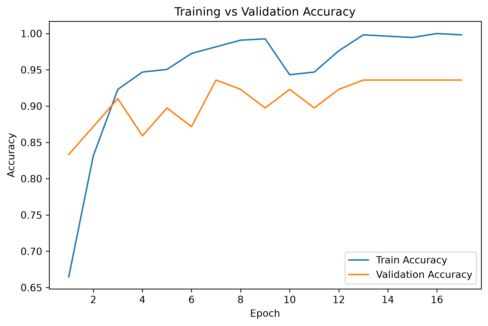
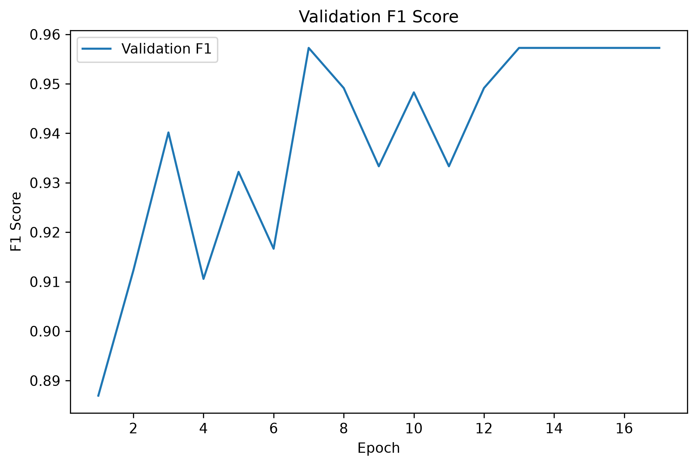

# MedVisionAI

## Breast Ultrasound Classification Using Deep Learning and Transfer Learning

MedVisionAI is a deep learning computer vision project exploring binary breast ultrasound image classification using convolutional neural networks and transfer learning.

The project evolved through two major experimental versions:

* **Version 1 — BreastMNIST:** Initial experimentation using the MedMNIST benchmark dataset. (Yang, J., et al. "MedMNIST v2 - A large-scale lightweight benchmark 
for 2D and 3D biomedical image classification." Scientific Data, 2023.)

* **Version 2 — BUSI:** A more realistic breast ultrasound classification experiment using the Breast Ultrasound Images Dataset (BUSI).

The project was developed to explore the complete machine learning workflow:

```text
Dataset
   ↓
Data Exploration
   ↓
Preprocessing
   ↓
Data Augmentation
   ↓
Model Development
   ↓
Transfer Learning
   ↓
Training Optimization
   ↓
Evaluation
   ↓
Explainability
   ↓
Deployment
```

The project currently focuses on binary classification:

```text
0 → Benign
1 → Malignant
```

> ⚠️ **Important:** MedVisionAI is an educational and research project. It is not a medical diagnostic system and must not be used for clinical decision-making.

---

# Live Demo

The MedVisionAI application is deployed using Streamlit Community Cloud.

🔗 **Live Demo:** https://medvisionai-web.streamlit.app

The application allows users to:

* Upload a breast ultrasound image
* Receive a benign or malignant prediction
* View the model's confidence score
* Generate a Grad-CAM visualization showing regions that influenced the prediction

---

# Project Evolution

## Version 1 — BreastMNIST

The first version of MedVisionAI used the **BreastMNIST** dataset from the MedMNIST collection.

The purpose of Version 1 was to:

* Build the initial data pipeline
* Experiment with medical image classification
* Develop a baseline CNN
* Explore transfer learning with ResNet18
* Implement training and evaluation pipelines
* Experiment with grayscale adaptation of pretrained models

The initial model achieved strong performance on the BreastMNIST benchmark dataset.

However, BreastMNIST consists of small 28 × 28 pixel images. This made it useful for experimentation but less representative of a realistic high-resolution ultrasound classification problem.

---

## Version 2 — BUSI

The second version transitioned to the **Breast Ultrasound Images Dataset (BUSI)**.

This change was motivated by the desire to experiment with larger, more realistic breast ultrasound images.

Version 2 introduced:

* A larger image resolution
* A custom BUSI dataset loader
* A new train-validation-test split
* Transfer learning using ResNet18
* Data augmentation
* Class-weighted loss
* Learning-rate scheduling
* Early stopping
* Model checkpointing
* Grad-CAM explainability
* Streamlit deployment

The transition from BreastMNIST to BUSI represents the main development progression of the project.

---

# Dataset

## BUSI — Breast Ultrasound Images Dataset

The current version of MedVisionAI uses the Breast Ultrasound Images Dataset (BUSI).

The dataset contains breast ultrasound images categorized into:

* Normal
* Benign
* Malignant

For this project, the classification task was simplified to binary classification:

| Class     | Label |
| --------- | ----: |
| Benign    |     0 |
| Malignant |     1 |

Normal images were excluded from the current binary classification experiment.

The dataset contains approximately 780 ultrasound images, originally collected from 600 women between the ages of 25 and 75.

Dataset source:

https://www.kaggle.com/datasets/sabahesaraki/breast-ultrasound-images-dataset

---

## Dataset Characteristics

* Breast ultrasound images
* Grayscale medical images
* PNG format
* Binary classification task
* Small-scale medical imaging dataset
* Class imbalance between benign and malignant samples

The dataset contains both ultrasound images and segmentation masks. Segmentation mask files were excluded from the classification dataset.

---

# Dataset Splitting

The BUSI dataset was divided into:

```text
70% Training
15% Validation
15% Testing
```

A fixed random seed was used to make the split reproducible:

```python
torch.Generator().manual_seed(42)
```

The training set uses data augmentation, while the validation and test sets use deterministic preprocessing.

```text
Training Dataset
        ↓
Resize
        ↓
Random Rotation
        ↓
Random Translation
        ↓
Tensor Conversion
        ↓
Normalization
```

Validation and test datasets:

```text
Validation/Test Dataset
        ↓
Resize
        ↓
Tensor Conversion
        ↓
Normalization
```

---

# Project Pipeline

```text
                BUSI Dataset
                     ↓
           Dataset Exploration
                     ↓
              Data Cleaning
                     ↓
          Remove Segmentation Masks
                     ↓
           Binary Classification
          Benign vs Malignant
                     ↓
              Dataset Splitting
            70% / 15% / 15%
                     ↓
              Image Preprocessing
                     ↓
              Data Augmentation
                     ↓
        ┌────────────┴────────────┐
        ↓                         ↓
    CNN Baseline          ResNet18 Transfer
                              Learning
                                  ↓
                       Architecture Adaptation
                                  ↓
                       Grayscale Input Support
                                  ↓
                       Binary Classification Head
                                  ↓
                              Training
                                  ↓
                     Weighted Cross Entropy Loss
                                  ↓
                         Adam Optimizer
                                  ↓
                     Learning Rate Scheduling
                                  ↓
                          Early Stopping
                                  ↓
                       Best Model Checkpoint
                                  ↓
                            Evaluation
                                  ↓
            Accuracy | Precision | Recall | F1
                                  ↓
                            Grad-CAM
                                  ↓
                             Deployment
```

---

# Model Development

Two main approaches were explored.

## 1. Custom CNN Baseline

A custom convolutional neural network was developed as an initial baseline.

The purpose of the CNN was to:

* Establish an initial performance benchmark
* Test the classification pipeline
* Understand the difficulty of the dataset
* Compare training from scratch with transfer learning

The CNN baseline provided a reference point for evaluating the benefits of pretrained models.

---

## 2. ResNet18 Transfer Learning

The primary model uses ResNet18.

Instead of training a deep neural network entirely from scratch, the model uses visual features learned from ImageNet and adapts the architecture for grayscale breast ultrasound classification.

Transfer learning was selected because medical imaging datasets are often relatively small compared with datasets such as ImageNet.

Potential advantages include:

* Faster convergence
* Reuse of learned visual features
* Improved feature extraction
* Reduced need for extremely large datasets

---

# ResNet18 Architecture Adaptation

The original ResNet18 architecture expects RGB images.

```text
Original Input:

RGB Image
   ↓
3 Channels
   ↓
ResNet18
   ↓
1000 ImageNet Classes
```

The MedVisionAI model was adapted for grayscale ultrasound images:

```text
Grayscale Ultrasound Image
   ↓
1 Channel
   ↓
Modified ResNet18
   ↓
Feature Extraction
   ↓
2-Class Classifier
   ↓
Benign / Malignant
```

---

## Grayscale Input Modification

The original ResNet18 first convolutional layer expects three input channels:

```python
Conv2d(
    in_channels=3,
    out_channels=64
)
```

The model was modified to accept a single grayscale channel:

```python
Conv2d(
    in_channels=1,
    out_channels=64
)
```

To initialize the grayscale convolution using the pretrained RGB filters, the RGB weights were averaged across the channel dimension to produce a single-channel initialization.

```python
new_conv.weight[:] = old_conv.weight.mean(
    dim=1,
    keepdim=True
)
```

This produces a single-channel convolutional layer initialized using the pretrained RGB filters.

---

## Classification Head

The original ResNet18 model was designed for ImageNet classification:

```text
1000 Classes
```

The final classification layer was replaced with a binary classifier:

```python
self.model.fc = nn.Sequential(
    nn.Dropout(0.4),
    nn.Linear(
        self.model.fc.in_features,
        2
    )
)
```

The output classes are:

```text
0 → Benign
1 → Malignant
```

---

# Transfer Learning Strategy

The model initially freezes the pretrained ResNet18 parameters.

Selected deeper layers are then fine-tuned:

```text
Frozen:
- Initial layers
- Layer 1

Trainable:
- Layer 2
- Layer 3
- Layer 4
- Classification Head
```

This allows the model to preserve general visual features while adapting deeper feature representations to the breast ultrasound classification task.

---

# Image Preprocessing

The original BUSI images have significantly larger dimensions than the 224 × 224 input size expected by ResNet18.

Images are resized to:

```text
224 × 224 pixels
```

The images are then converted to tensors and normalized.

The current preprocessing pipeline is:

```text
Original Ultrasound Image
        ↓
Grayscale Conversion
        ↓
Resize to 224 × 224
        ↓
Tensor Conversion
        ↓
Normalization
        ↓
ResNet18
```

---

# Data Augmentation

To reduce overfitting and improve robustness, the training dataset uses augmentation.

## Random Rotation

```python
transforms.RandomRotation(
    degrees=5
)
```

This introduces small changes in orientation.

---

## Random Translation

```python
transforms.RandomAffine(
    degrees=0,
    translate=(0.05, 0.05)
)
```

This introduces small positional changes.

The validation and test datasets are not augmented.

---

# Training Strategy

The training pipeline includes several optimization techniques.

## Weighted Cross Entropy Loss

The BUSI dataset contains class imbalance.

To reduce bias toward the majority class, weighted cross-entropy loss was used:

```python
CrossEntropyLoss(
    weight=class_weights
)
```

This increases the contribution of underrepresented classes during training.

---

## Optimizer

The model is trained using Adam.

The learning rate is adjusted during training based on validation performance.

---

## Learning Rate Scheduling

A `ReduceLROnPlateau` scheduler is used to reduce the learning rate when validation performance stops improving.

The scheduler allows the model to make smaller updates when training approaches a plateau.

---

## Early Stopping

Early stopping is used to reduce overfitting.

Training stops when validation performance fails to improve for a predefined number of epochs.

The checkpoint with the best validation F1 score is saved.

```text
Training
   ↓
Validation F1 Improves
   ↓
Save Best Checkpoint
   ↓
Validation Stops Improving
   ↓
Reduce Learning Rate
   ↓
Continue Training
   ↓
Early Stopping
```

---

# Model Evaluation

The model is evaluated using:

* Accuracy
* Precision
* Recall
* F1 Score
* Confusion Matrix

The F1 score is particularly important because the dataset contains class imbalance and because both precision and recall are important for the classification task.

---

# BUSI Model Performance

The final reported BUSI results should be kept as a separate experimental result from the BreastMNIST results.

At the time of writing, the BUSI model achieved:

| Metric    |  Score |
| --------- | -----: |
| Accuracy  | 88.78% |
| Precision | 77.78% |
| Recall    | 80.77% |
| F1 Score  | 79.25% |

Confusion Matrix:

```text
[[66  6]
 [ 5 21]]
```

Interpretation:

```text
66 benign images were correctly classified.

21 malignant images were correctly classified.

6 benign images were incorrectly classified as malignant.

5 malignant images were incorrectly classified as benign.
```

> These results should be interpreted in the context of the relatively small dataset and the specific train-validation-test split used in this experiment.

---

# BreastMNIST Version 1 Results

The original BreastMNIST experiment achieved:

| Metric    |  Score |
| --------- | -----: |
| Accuracy  | 88.46% |
| Precision | 91.38% |
| Recall    | 92.98% |
| F1 Score  | 92.17% |

Confusion Matrix:

```text
[[32 10]
 [ 8 106]]
```

These results belong to the original BreastMNIST experiment and should not be presented as the BUSI model's results.

---

# Why the Results Should Not Be Directly Compared

The BreastMNIST and BUSI experiments use different datasets.

They differ in:

* Dataset size
* Image resolution
* Data distribution
* Class composition
* Dataset splitting
* Image characteristics

Therefore, the performance metrics should not be interpreted as a direct benchmark between the two models.

The purpose of the two versions is to demonstrate the evolution of the project:

```text
Version 1:
BreastMNIST
   ↓
Initial Experimentation
   ↓
Model Development

Version 2:
BUSI
   ↓
More Realistic Ultrasound Dataset
   ↓
Custom Dataset Pipeline
   ↓
Further Transfer Learning Experiments
```

---

# Explainable AI — Grad-CAM

MedVisionAI integrates Gradient-weighted Class Activation Mapping (Grad-CAM).

Grad-CAM generates a heatmap showing regions of an image that contributed to the model's prediction.

```text
Ultrasound Image
        ↓
ResNet18
        ↓
Prediction
        ↓
Gradient Analysis
        ↓
Grad-CAM Heatmap
        ↓
Important Image Regions
```

Grad-CAM is useful because classification accuracy alone does not explain why a model made a prediction.

---

## Correct Classification Example



Example:

```text
Prediction: Malignant
Confidence: 97.11%
True Label: Malignant
```

---

## Misclassification Example



Example:

```text
Prediction: Malignant
Confidence: 76.51%
True Label: Benign
```

This demonstrates that the model can make incorrect predictions, even with relatively high confidence.

This is one reason model explainability and external validation are important in medical AI research.

---

# Deployment

The application is deployed using Streamlit Community Cloud.

```text
GitHub Repository
        ↓
Streamlit Community Cloud
        ↓
MedVisionAI Web Application
        ↓
Image Upload
        ↓
Preprocessing
        ↓
ResNet18 Inference
        ↓
Prediction
        ↓
Confidence Score
        ↓
Optional Grad-CAM Visualization
```

The application provides:

* Image upload
* Benign/malignant classification
* Confidence score
* Optional Grad-CAM visualization
* Research and educational disclaimer

---

# Project Structure

```text
MedVisionAI/
│
├── models/
│   └── checkpoints/
│       ├── resnet18_breastmnist_final_best_f1.pth
│       └── resnet18_busi_final.pth
│
├── notebooks/
│   └── 01_dataset_exploration.ipynb
│
├── scripts/
│   ├── predict.py
│   ├── evaluate_busi.py
│   ├── evaluate_resnet.py
│   └── __init__.py
│
├── src/
│   │
│   ├── data/
│   │   ├── dataloader.py
│   │   ├── resnet_dataloader.py
│   │   └── busi_dataset.py
│   │
│   ├── models/
│   │   ├── cnn.py
│   │   └── resnet.py
│   │
│   ├── train/
│   │   ├── train.py
│   │   └── train_resnet.py
│   │
│   ├── explainability/
│   │   └── gradcam_utils.py
│   │
│   └── __init__.py
│
├── app.py
├── .gitignore
├── LICENSE
├── README.md
└── requirements.txt
```

---

# Development Environment

| Component    | Details                         |
| ------------ | -------------------------------- |
| Python       | 3.12                            |
| PyTorch      | PyTorch                         |
| Torchvision  | Torchvision                     |
| Scikit-learn | Scikit-learn                    |
| Streamlit    | Streamlit                       |
| Hardware     | Apple Silicon                   |
| Acceleration | Apple Metal Performance Shaders |

Training was performed using Apple's Metal Performance Shaders acceleration:

```text
Using device: mps
```

This enabled GPU acceleration on Apple Silicon hardware.

---

# Installation

## Clone the Repository

```bash
git clone https://github.com/DunatosCharles/MedVisionAI.git

cd MedVisionAI
```

---

## Create a Virtual Environment

```bash
python -m venv clean_test
```

Activate it:

### macOS / Linux

```bash
source clean_test/bin/activate
```

---

## Install Dependencies

```bash
pip install -r requirements.txt
```

---

# Training

To train the ResNet18 model:

```bash
python -m src.train.train_resnet
```

The training process includes:

* Dataset loading
* Data augmentation
* Weighted loss
* Model training
* Learning-rate scheduling
* Validation
* Early stopping
* Checkpoint saving

---

# Evaluation

To evaluate the BUSI model:

```bash
python -m scripts.evaluate_busi
```

The evaluation script calculates:

```text
Accuracy
Precision
Recall
F1 Score
Confusion Matrix
```

---

# Inference

The trained model can be used to classify new ultrasound images.

```bash
python -m scripts.predict
```

The inference pipeline:

```text
Input Image
     ↓
Grayscale Conversion
     ↓
Resize
     ↓
Normalization
     ↓
ResNet18
     ↓
Softmax Probabilities
     ↓
Prediction
     ↓
Confidence Score
```

---

# Training Curves

The project includes training visualizations such as:

### Training Loss



### Accuracy



### Validation F1 Score



These visualizations help analyze:

* Convergence
* Overfitting
* Validation performance
* Learning-rate effects

---

# Limitations

Several limitations should be considered.

## Dataset Size

The BUSI dataset is relatively small compared with large-scale computer vision datasets.

This increases the risk of:

* Overfitting
* High variance between train/test splits
* Unstable performance estimates

---

## Dataset Splitting

The reported BUSI results are based on a single randomized train-validation-test split.

Therefore, the results may change with a different split.

Future experiments should investigate:

* Stratified splitting
* K-fold cross-validation
* Multiple random seeds
* Confidence intervals

---

## Generalization

The model may not generalize reliably to:

* Different ultrasound machines
* Different hospitals
* Different patient populations
* Different image acquisition protocols
* Different image preprocessing pipelines

---

## Medical Use

The model is not clinically validated.

It should not be used to:

* Diagnose patients
* Replace radiologists
* Make treatment decisions
* Provide medical advice

---

# Future Work

## 1. Cross-Validation

Because the dataset is relatively small, K-fold cross-validation would provide a more reliable estimate of model performance.

Potential experiments include:

```text
Dataset
   ↓
K-Fold Split
   ↓
Train Model Multiple Times
   ↓
Evaluate Each Fold
   ↓
Calculate Mean ± Standard Deviation
```

---

## 2. Patient-Level Data Splitting

If patient identifiers are available, future experiments should ensure that images from the same patient do not appear across multiple dataset splits.

This would help reduce potential data leakage.

---

## 3. Larger Architectures

Future models could include:

* ResNet50
* EfficientNet
* ConvNeXt
* Vision Transformers

These models could be compared against ResNet18.

---

## 4. Hyperparameter Optimization

Future experiments could investigate:

* Learning rates
* Batch sizes
* Optimizers
* Weight decay
* Dropout rates
* Fine-tuning depth

---

## 5. Advanced Augmentation

Possible future techniques include:

* Contrast adjustment
* Gaussian noise
* Random cropping
* MixUp
* CutMix

However, augmentation strategies should be carefully evaluated for medical images to ensure that they do not create unrealistic samples.

---

## 6. Segmentation-Based Classification

The BUSI dataset includes segmentation masks.

A future experiment could investigate whether explicitly using lesion segmentation improves classification performance.

Possible pipeline:

```text
Ultrasound Image
        ↓
Lesion Segmentation
        ↓
Region of Interest Extraction
        ↓
Classification
        ↓
Benign / Malignant
```

---

## 7. External Validation

A major future improvement would be evaluating the model on an independent external dataset.

This would provide a better estimate of generalization to unseen data distributions.

---

## 8. Model Calibration

Future work could evaluate whether the model's confidence scores are reliable.

A model predicting:

```text
95% confidence
```

should ideally be correct approximately 95% of the time under similar conditions.

Calibration methods could include:

* Reliability diagrams
* Expected Calibration Error
* Temperature scaling

---

# Research Direction

The project is currently evolving from a benchmark-oriented experiment toward a more realistic medical imaging research workflow.

The main development progression is:

```text
BreastMNIST
    ↓
Initial CNN Experiments
    ↓
ResNet18 Transfer Learning
    ↓
Grayscale Architecture Adaptation
    ↓
BUSI Dataset
    ↓
Custom Dataset Pipeline
    ↓
Fine-Tuning Experiments
    ↓
Grad-CAM Explainability
    ↓
Web Deployment
    ↓
Future External Validation
```

The main objective is not simply to maximize a single test score.

Instead, the project aims to explore:

* How pretrained computer vision models can be adapted to medical imaging
* How dataset choice affects model performance
* How class imbalance affects training
* How model architecture and fine-tuning strategies influence generalization
* How explainability methods can help analyze model predictions
* How to build reproducible medical AI experiments

---

# Disclaimer

MedVisionAI is developed for educational and research purposes only.

It is not a medical diagnostic system.

The predictions generated by this model should not replace:

* Medical professionals
* Radiologists
* Clinical evaluation
* Professional diagnostic procedures

The model has not been clinically validated and should not be used for real-world medical decision-making.

---

# Author

## Dunatos Charles

Machine Learning and Computer Vision Developer

### Interests

* Artificial Intelligence
* Deep Learning
* Computer Vision
* Medical AI
* Machine Learning Research
* Explainable AI

---

# Project Summary

MedVisionAI demonstrates the development of a complete deep learning medical imaging pipeline.

The project evolved from an initial BreastMNIST experiment into a more advanced BUSI-based experiment involving:

```text
Dataset Exploration
        ↓
Data Preprocessing
        ↓
CNN Baseline
        ↓
Transfer Learning
        ↓
ResNet18 Adaptation
        ↓
Data Augmentation
        ↓
Class-Imbalanced Training
        ↓
Learning-Rate Scheduling
        ↓
Early Stopping
        ↓
Model Evaluation
        ↓
Grad-CAM Explainability
        ↓
Streamlit Deployment
```

The project serves as a foundation for future research into:

* Medical image classification
* Transfer learning
* Explainable AI
* Cross-dataset generalization
* External validation
* More robust medical computer vision systems

---

## Research Feedback

This project is actively being developed and improved.

Feedback regarding the methodology, dataset selection, model architecture, evaluation strategy, explainability, and potential future experiments would be highly valuable.

In particular, areas of interest include:

* Improving the reliability of evaluation on small medical datasets
* Designing better validation strategies
* Avoiding data leakage
* Improving generalization across datasets
* Comparing different transfer learning approaches
* Using segmentation information from the BUSI dataset
* Evaluating explainability methods such as Grad-CAM